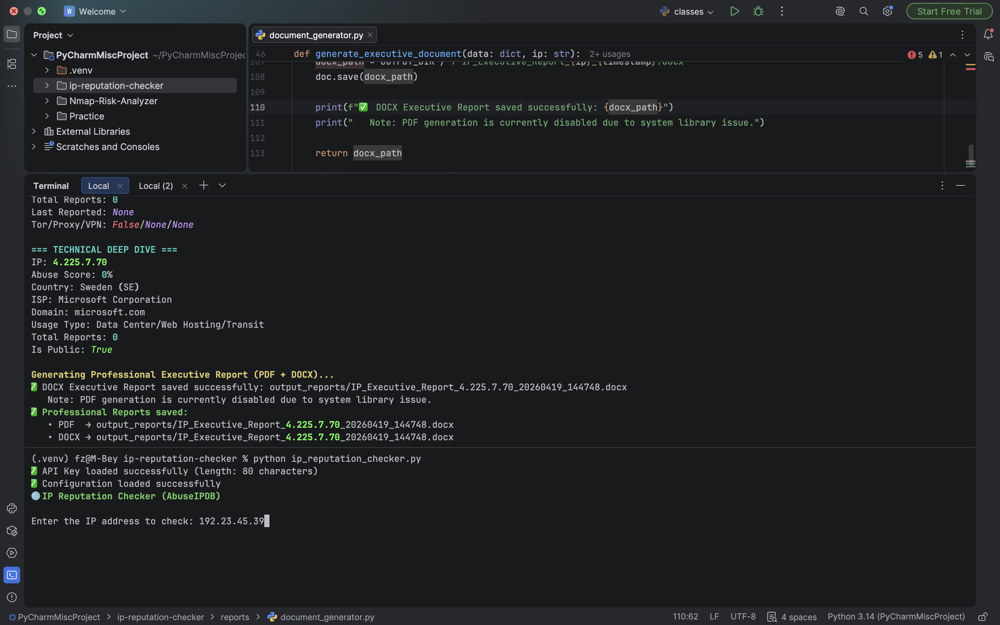
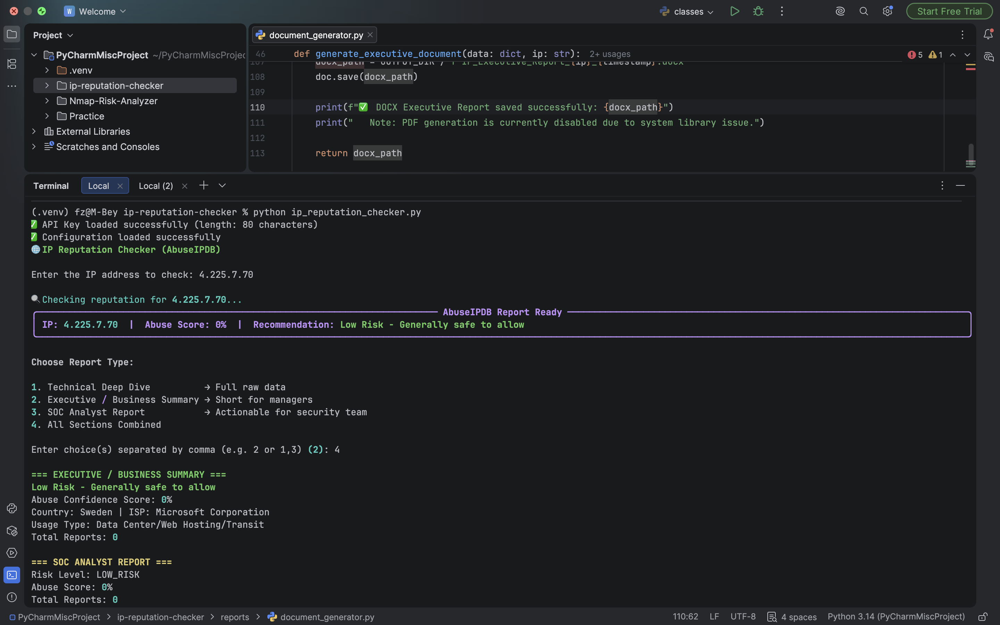
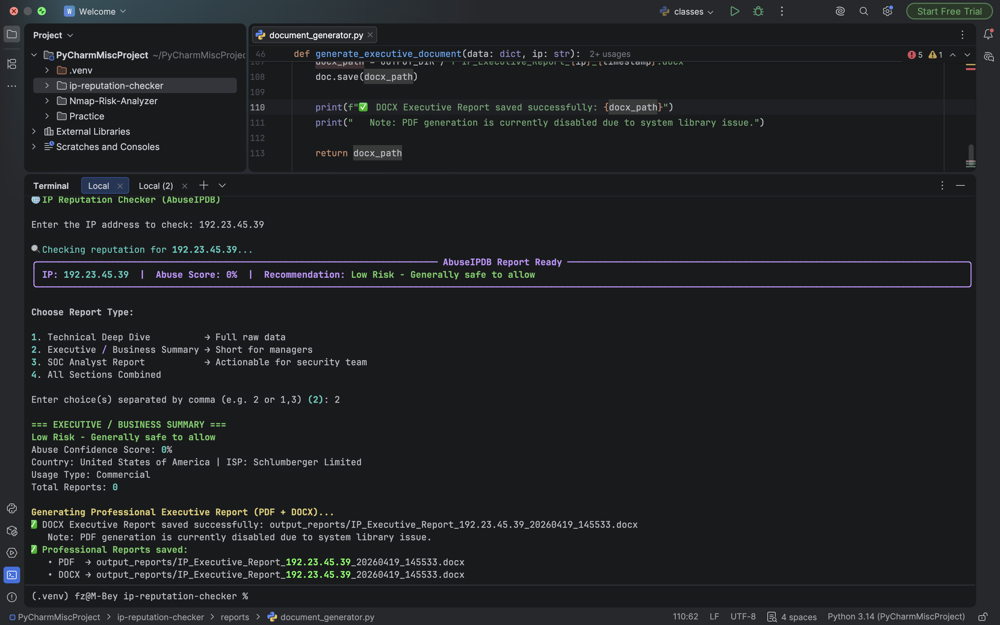
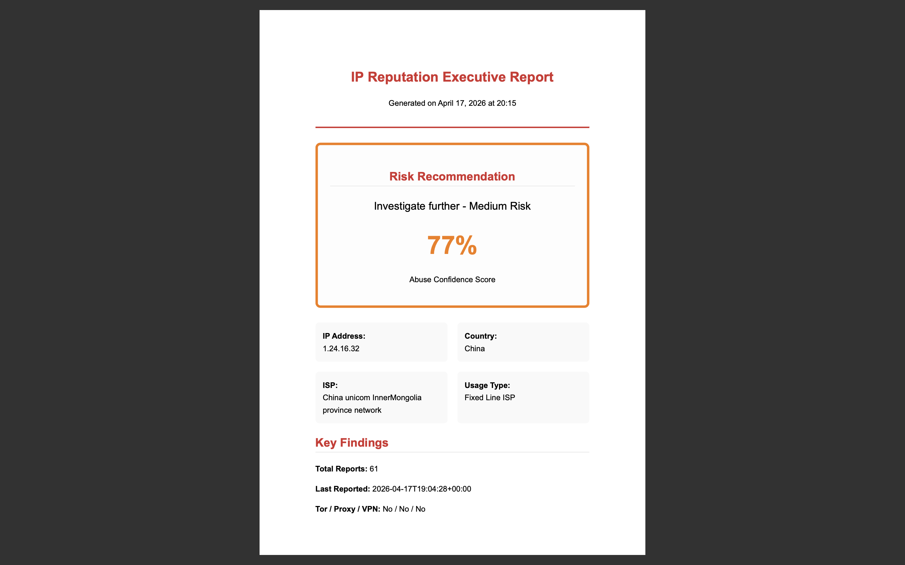
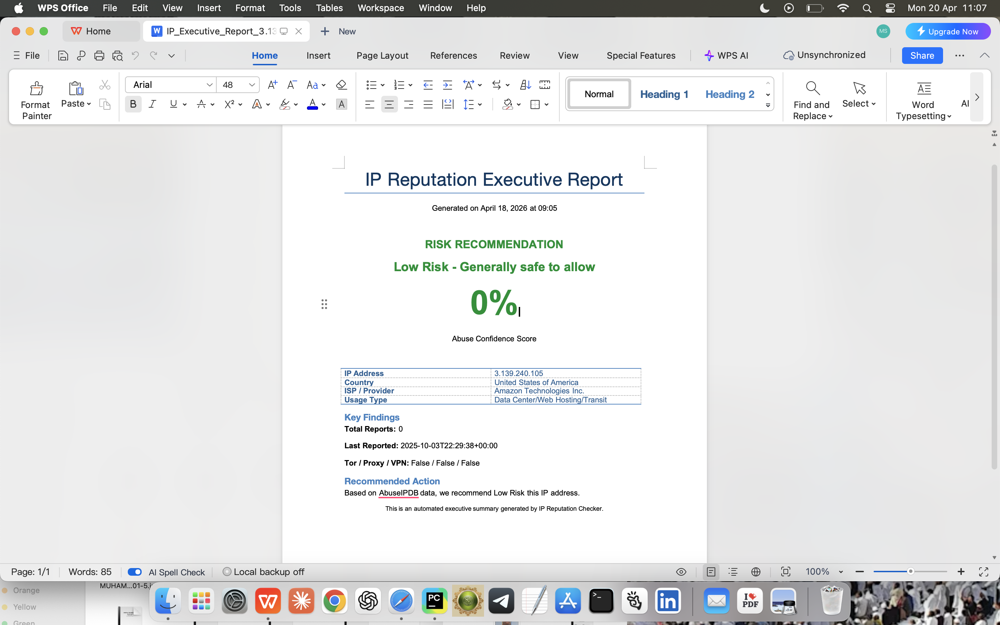

# Ip-reputation-checker

**Threat Intel Enrichment Tool**  
Turns raw IP addresses from logs into actionable threat intelligence using AbuseIPDB.

Built during my transition from SOC Analyst to AI Security Engineer.


### 1. Problem Statement

SOC analysts constantly see suspicious IPs in firewall logs, failed login attempts, IDS alerts, and incident tickets. Manually checking each IP on websites like AbuseIPDB breaks workflow and wastes valuable time.

**Real-World Scenario:**  
After multiple brute-force attacks on RDP and VPN, analysts spot several unknown IPs in the authentication logs. They have to switch context, open a browser, paste each IP one by one, and interpret the results. This slow process delays blocking malicious actors and increases the chance of successful compromise.

This tool allows analysts to quickly enrich IPs directly from the terminal and get professional reports without leaving their workflow.

### 2. Business / Security Value

- Saves analysts significant time — check IPs in seconds instead of minutes.
- Improves incident response speed by enabling faster blocking of malicious IPs.
- Reduces alert fatigue by providing clear risk recommendations (BLOCK / INVESTIGATE / LOW RISK).
- Produces professional DOCX executive reports ready for tickets or management review.
- Supports daily SOC operations, log reviews, and automation playbooks.

### 3. How It Works

1. Run the tool from the terminal.
2. Enter a single IP address when prompted.
3. Choose report type via an interactive menu.
4. Get rich colored terminal output + a professional DOCX executive report automatically generated.

The tool fetches real-time data from AbuseIPDB (abuse confidence score, number of reports, categories, ISP, Tor/Proxy/VPN usage, etc.) and gives a clear risk recommendation.

### 4. Screenshots

 

 
 

*Rich terminal interface with interactive menu and colored risk recommendation*


*Professional PDF Executive Report with risk box and clean layout*


*Highlighted Risk Recommendation section in the generated DOCX*


### 5. Current Limitations

- Single IP lookup only (batch mode coming soon).
- Depends on AbuseIPDB free tier (1,000 checks per day).
- No local caching yet (every lookup hits the API directly).

### 6. Future Roadmap / AI Security Angle

- Add batch processing from log files (auto-extract IPs from auth logs).
- Integrate with Project 0 (CVE Hunter) and Nmap Analyzer for combined enrichment.
- Add ML-based risk scoring using historical lookup patterns.
- Evolve into a lightweight guardrail for AI agents or automated SOAR playbooks.

---

### Installation & Usage (Step-by-Step Guide)

#### Hardware Requirements
- Any laptop/desktop (Windows, macOS, or Linux)
- Python 3.10 or higher

#### Prerequisites
- Free AbuseIPDB API key (sign up at https://www.abuseipdb.com/account/api)

#### Step 1: Clone the Repository
```bash
git clone https://github.com/YOUR-USERNAME/ai-sec-ip-reputation-checker.git
cd ai-sec-ip-reputation-checker

Step 2: Install Dependencies
pip install -r requirements.txt
Step 3: Add Your API Key

Open .env and paste your key:envABUSEIPDB_API_KEY=your_actual_key_here

Step 4: Run the Tool
python ip_reputation_checker.py
Then:

Enter the IP address when prompted
Choose a report type (e.g., 4 for All Sections)
Get rich terminal output + professional DOCX report in the reports/ folder


Tech Stack

Python 3.11+
requests — API calls
python-dotenv — Secure API key handling
rich — Beautiful terminal UI
python-docx — Professional reports